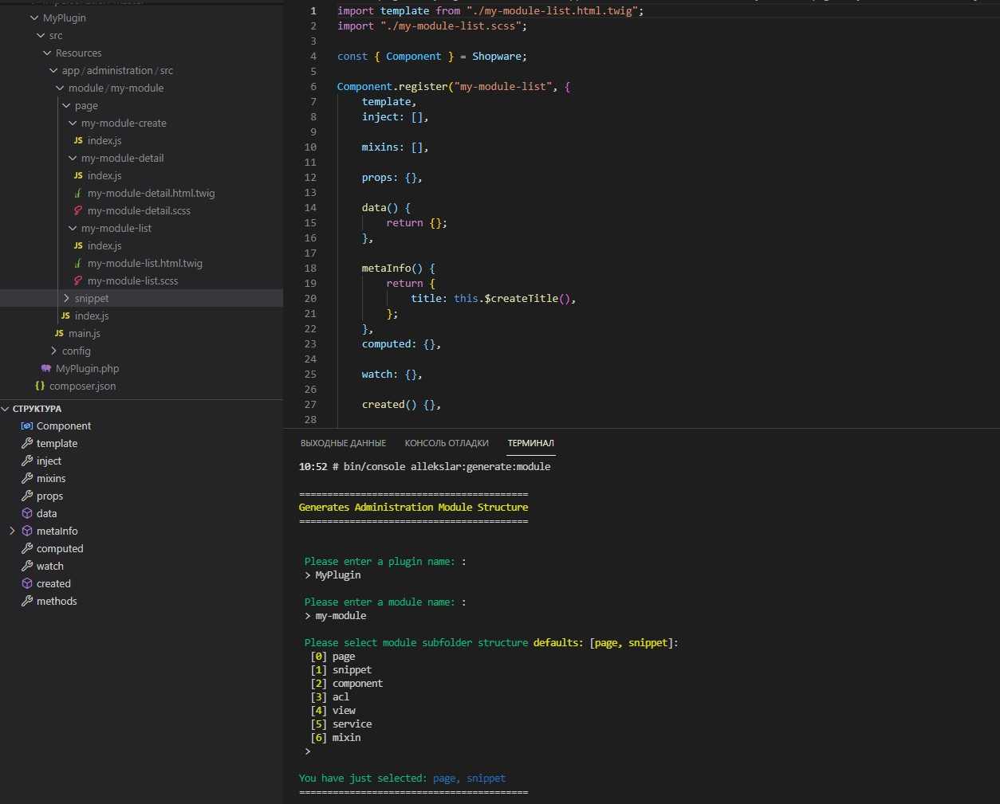

# Generates the administrative module structure for the Shopware 6 plugin.

### Installation

- `composer require allekslar/module-generator`
- `bin/console plugin:refresh`
- `bin/console plugin:install --activate --clearCache  AllekslarModuleGenerator`

### Commands
The first parameter accepts the name of the plugin for which the scaffolding should be generated.

The second parameter accepts the name of the module. 

- `bin/console allekslar:generate:module <pluginName> <moduleName>`

or

- `bin/console allekslar:generate:module`  requests options interactively
